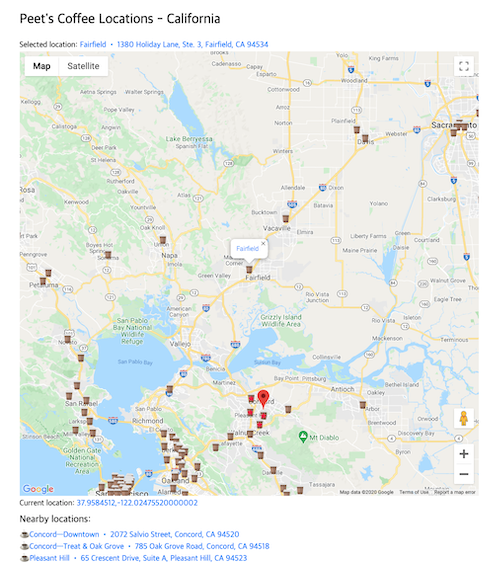
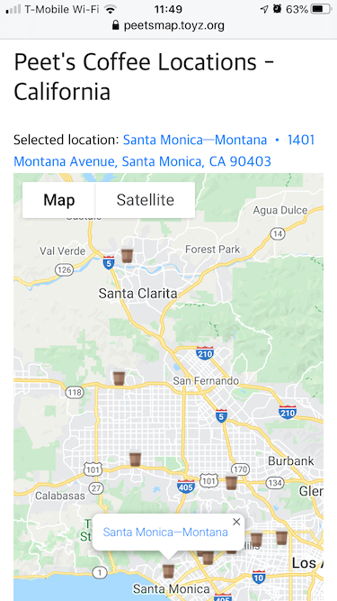

# Peet's Coffee Locator

I built this app because the official Peet's app and website are so terrible for locating Peet's shops.

This is a simple webapp using the Google Maps API to locate Peet's Coffee shops and get directions to them.

It's pretty specific to my needs:

* Has data for all Peet's locations in California but no other states/locations
* Opens Apple Maps for directions

You can modify it for your needs or generalized it.

Deployed to:

https://peetsmap.toyz.org

## Screenshots

Desktop

Mobile

### Customization

You will need a Google Maps API key of course.

As noted, the app has data on Peet's locations in California, scraped from the Peet's website and geocoded using the [Texas A&M Geocoding Services](http://geoservices.tamu.edu/Services/Geocode/). You can generate data for other states or generalize the app to select states.

Also, the app opens Apple Maps to get directions to a selected Peet's store. You can change the links to use a different app or perhaps even allow the user to choose an app and save it to a cookie or otherwise.

There is minimal CSS styling; if you're into that kind of thing, hack away.
